# Patch — Muscovy Duck Codex Pet

  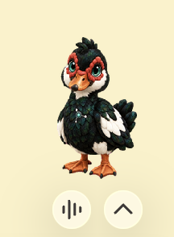

Patch is a curious plush Muscovy duck who tends ideas and patiently fixes what matters. This repository contains the complete Codex v2 pet, the ready-to-share ZIP, and its preview images.

## Download and install

1. Download [`Patch-Codex-Pet.zip`](downloads/Patch-Codex-Pet.zip).
2. Unzip it and copy the included `patch` folder into your Codex pets directory:
   - macOS/Linux: `~/.codex/pets/patch`
   - Windows: `%USERPROFILE%\.codex\pets\patch`
3. Open **Settings → Pets** in the Codex desktop app.
4. Select **Refresh**, choose **Patch**, then enter `/pet` to wake the duck.

The installed folder must contain both [`pet.json`](patch/pet.json) and [`spritesheet.webp`](patch/spritesheet.webp). Patch uses the v2 desktop-pet format with a `1536 × 2288` sprite atlas.

[Official Codex pet instructions](https://developers.openai.com/codex/pets)

## Animation previews

| Idle | Running | Waiting |
|:---:|:---:|:---:|
| 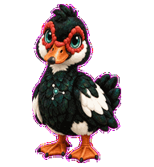 | 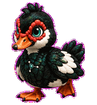 | 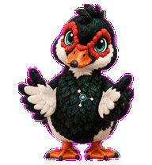 |
| **Waving** | **Jumping** | **Review** |
| 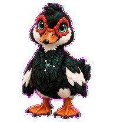 | 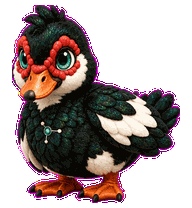 | 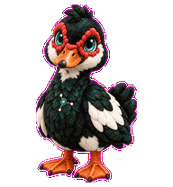 |
| **Running left** | **Running right** | **Failed** |
| 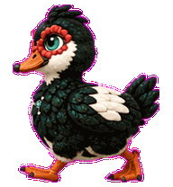 | 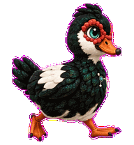 | 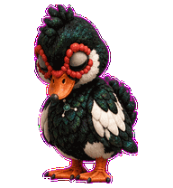 |

## Sprite QA

### Animation contact sheet

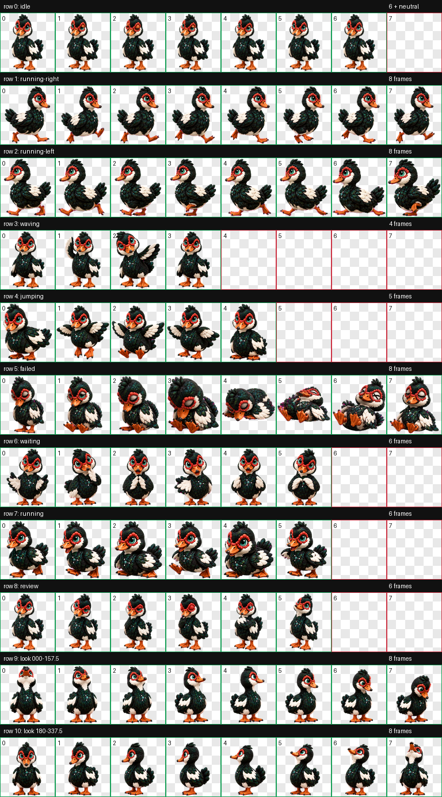

### Look directions

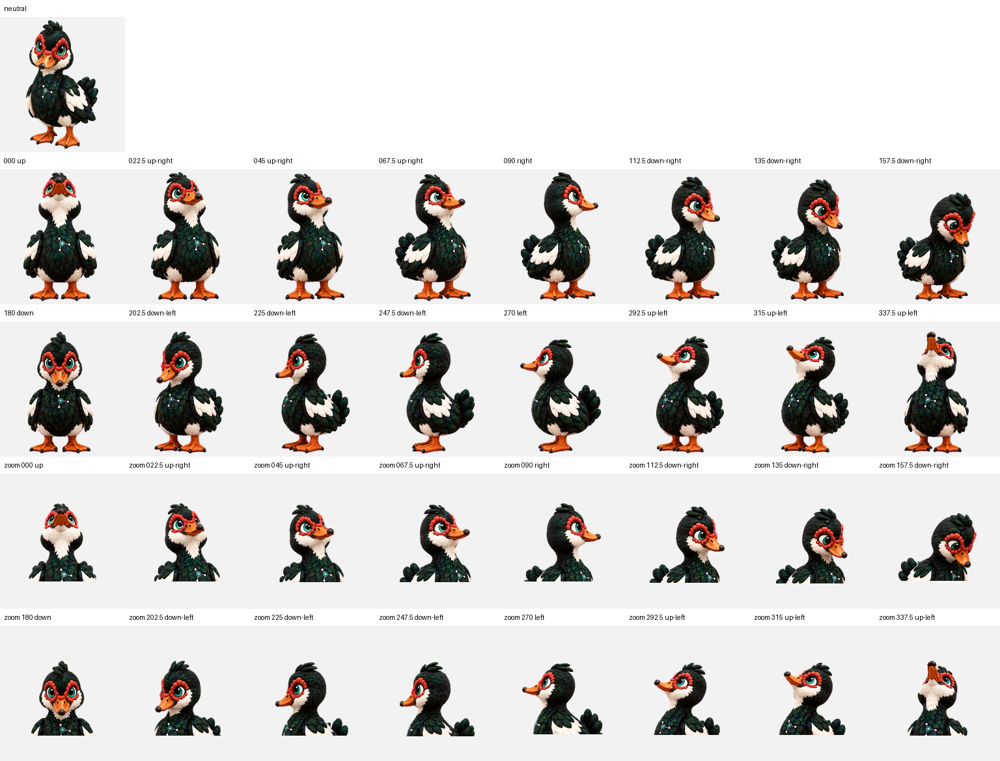

## Integrity

SHA-256 checksums are recorded in [`CHECKSUMS.sha256`](CHECKSUMS.sha256).
